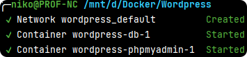

# Docker Compose Wordpress


## Commande pour lancer la stack

`docker-compose --env-file .env up -d`



## Volumes

| Dossier     | Utilisation                                                               |
|-------------|---------------------------------------------------------------------------|
| `./wp-app`  | Contient les fichiers de wordpress                                        |
| `./config`  | Contient les fichiers de configurations des différents containers |
| `./db_data`   | Contient les fichiers de la base de données                               |
| `./backups` | Contient la sauvegarde de la base de données                              |

## Rappels des ports utilisés dans la stack

| Ports | Utilisation         |
|-------|---------------------|
| 8080  | Wordpress           |
| 8081  | PhpMyAdmin          |
| 3308  | MySQL               |
| 8025  | MailHog (accès web) |
| 1025 | MailHog (mail)      |


# Source

https://www.bitdoze.com/install-wordpress-docker/#3-setup-env-file

---

# MailHog

Extension Check Email
Activer le log des emails

Modifier le fichier **functions.php** du thème activé.

Ajouter ce code pour modifier l'adresse d'envoi des emails.

```php
add_filter( 'wp_mail_from', function( $email ) {
    return 'webmaster@mydomainname.com';
} );
```